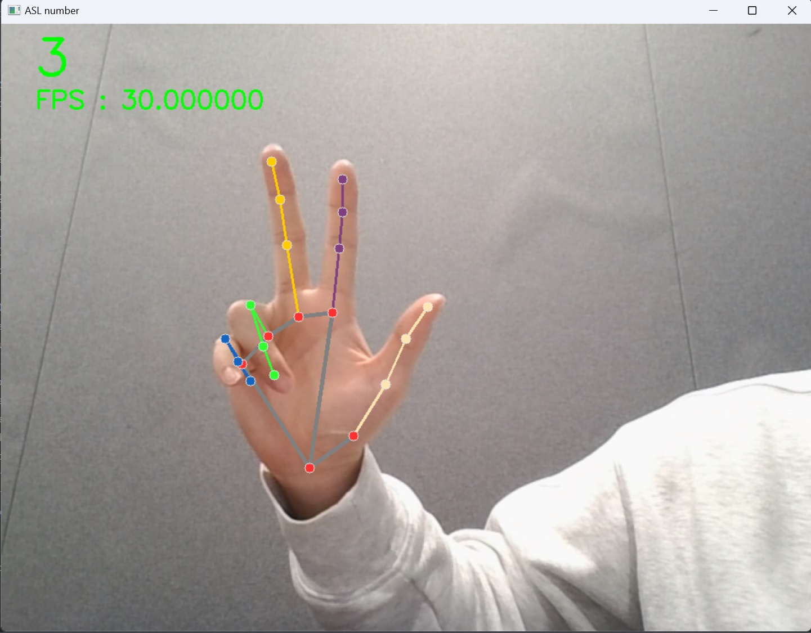
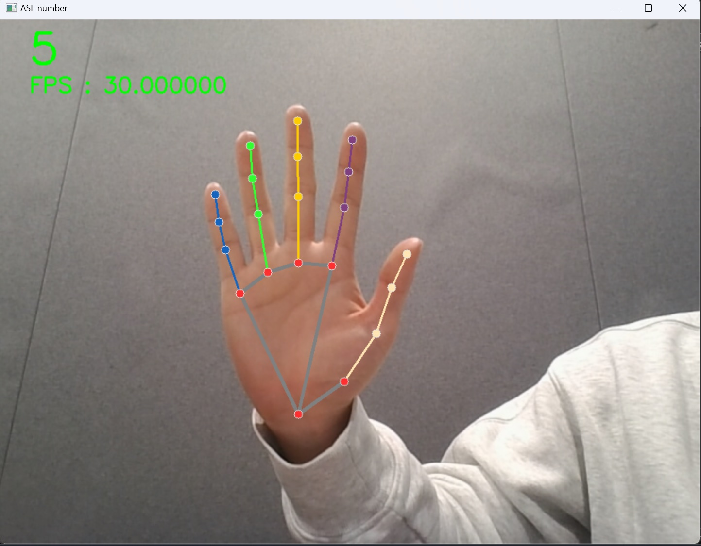

# ASL Number Detection with Mediapie Hands
### 2022 겨울 계절학기 인공지능시스템 설계 프로젝트 수업에서 `2023.01.14 - 2023.01.18` 에 진행한 Term Project 입니다.

* Detects ASL number(1 - 10) from recorded video or real-time webcam video.
* Outputs video file(result.mp4) with detected number and text file(result.txt).
* Creates training dataset from ASL number images and trains the model by the dataset.

---

<p algin="center">
  
  
</p>

---

## How does it work?
[Mediapipe Hands](https://google.github.io/mediapipe/solutions/hands.html) provides a fast and accurate framework for recognizing hand posture. It gives x, y, z position coordinates of 21 landmarks(joints) of hand from an image or each frames of a video. (As shown in the above image.)

Rather than just naively using the position data, converting the position to the angles between skeletones of hand, gave much more robust predictions for translation, rotation, scale variations of hand. The converted angles then put into the 3-layer MLP model(NumberDetector), and finally gets prediction for the given image or frame.

---
## File description
### 1. ASL_number.py

* Main file of the project.

* Input video path to use recorded video.
```python
path = "./folder/video.mp4"
```
* Input 0 to use webcam.
```python
path = 0
```

### 2. Hand_Landmark_Creator.py

* Creates scv file containing x, y, z position of 21 landmark points. (total 63 value for each image)

### 3. HandAngle.py

* Converts 63-D x, y, z position vector to 210-D angle vector.

### 4. NumberDetector_state_dict.pt

* Pre-trained weights for NumberDetector model.

### 5. NumberDetector_training.py

* Training code for NumberDetector model.

### 6. NumberDetector.py

* NumberDetector model which gets 210-D angle vector and outputs 10-D probability vector.

* The model uses 3 layers of MLP using dropout.
